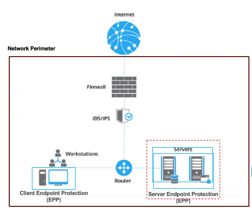
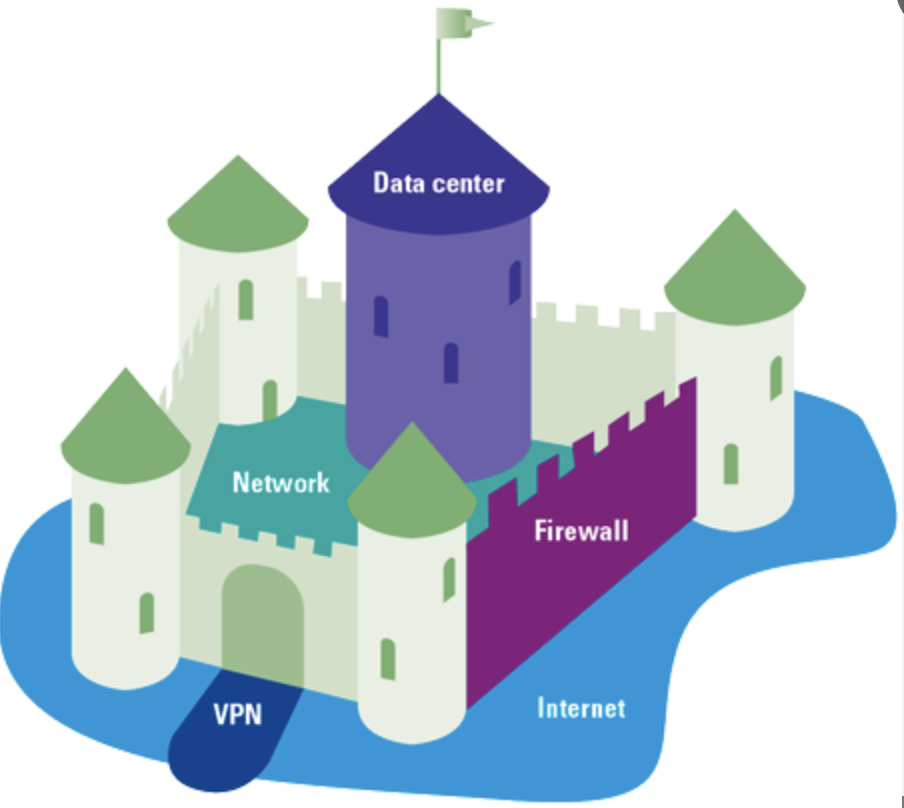
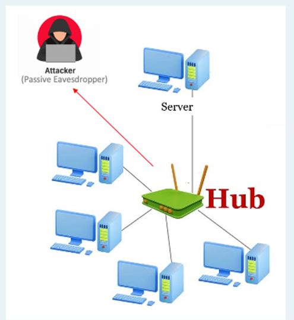
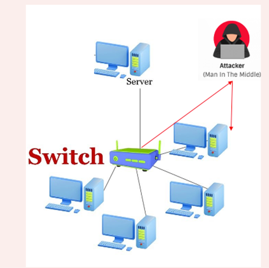
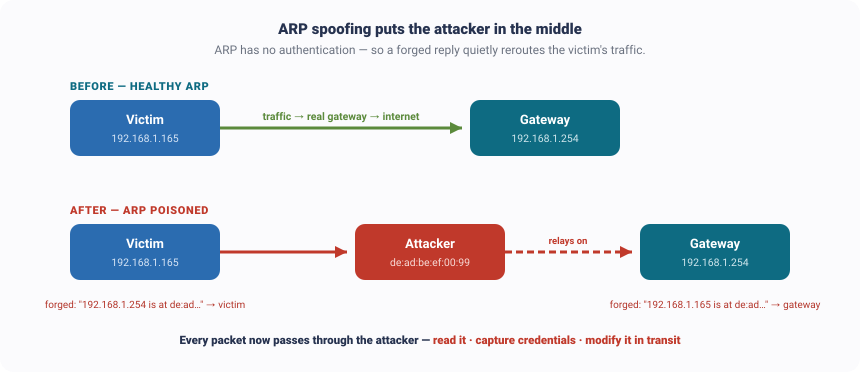

---
hide:
  - navigation
---

[← Course home](../index.html) · Ethical Hacking

# Week 4 · Network Hacking & Sniffing

🧭 Kill chain · Phase 3 — Gaining Access (the quiet way)

ATT&CK <a href="https://attack.mitre.org/techniques/T1040/" class="attck-tag" target="_blank">T1040 Network Sniffing</a> <a href="https://attack.mitre.org/techniques/T1557/" class="attck-tag" target="_blank">T1557 Adversary-in-the-Middle</a> <a href="https://attack.mitre.org/techniques/T1557/002/" class="attck-tag" target="_blank">T1557.002 ARP Cache Poisoning</a> <a href="https://attack.mitre.org/tactics/TA0005/" class="attck-tag" target="_blank">TA0005 Defense Evasion</a>

This week alternates between the 🔴 attacker's move and the 🔵 blue team's answer — the coloured line down the left tells you which one you're reading.

🔴 RED TEAM · the attack

What you'll learn

- Where we are in the CEH kill chain — **Phase 3, gaining access** — and the two ways in
- The **quiet way**: reading a password straight off the wire — and how the blue team answers it (**encrypt everything + the firewall**)
- Once **inside**, why listening to the network is **reconnaissance from within** — passive vs. active sniffing
- **ARP spoofing** — becoming the man in the middle — and the blue-team answer (**detect, inspect, segment**)

## 1. Where we are: gaining access

We've been walking the attacker's life cycle — the **CEH kill chain**. We built the map (**recon**, Week 2), we tried the doors (**scanning**, Week 3), and now we're at **Phase 3 — gaining access**: actually getting in.

<figure>
<svg viewBox="0 0 860 132" role="img" aria-label="The five CEH phases: Reconnaissance and Scanning are done, Gaining Access is where we are now, Maintaining Access and Covering Tracks come later." xmlns="http://www.w3.org/2000/svg" style="width:100%;height:auto;display:block;font-family:'Segoe UI',system-ui,sans-serif;">
  <g fill="#c3cad6"><polygon points="160,60 177,60 177,54 189,62 177,70 177,64 160,64"/><polygon points="337,60 354,60 354,54 366,62 354,70 354,64 337,64"/><polygon points="515,60 532,60 532,54 544,62 532,70 532,64 515,64"/><polygon points="692,60 709,60 709,54 721,62 709,70 709,64 692,64"/></g>
  <rect x="0" y="14" width="150" height="96" rx="9" fill="#E6F1FB" stroke="#b6cfe8"/>
  <text x="75" y="40" text-anchor="middle" font-size="10" font-weight="700" letter-spacing="0.06em" fill="#0C447C">PHASE 1</text>
  <text x="75" y="64" text-anchor="middle" font-size="13.5" font-weight="700" fill="#0C447C">Reconnaissance</text>
  <text x="75" y="88" text-anchor="middle" font-size="11" fill="#3b6ea5">Week 2 ✓</text>
  <rect x="177" y="14" width="150" height="96" rx="9" fill="#E6F1FB" stroke="#b6cfe8"/>
  <text x="252" y="40" text-anchor="middle" font-size="10" font-weight="700" letter-spacing="0.06em" fill="#0C447C">PHASE 2</text>
  <text x="252" y="64" text-anchor="middle" font-size="13.5" font-weight="700" fill="#0C447C">Scanning</text>
  <text x="252" y="88" text-anchor="middle" font-size="11" fill="#3b6ea5">Week 3 ✓</text>
  <rect x="354" y="8" width="150" height="108" rx="9" fill="#C0392B"/>
  <text x="429" y="36" text-anchor="middle" font-size="10" font-weight="700" letter-spacing="0.06em" fill="#f7d9d5">PHASE 3</text>
  <text x="429" y="62" text-anchor="middle" font-size="14" font-weight="800" fill="#ffffff">Gaining Access</text>
  <text x="429" y="88" text-anchor="middle" font-size="10.5" font-weight="700" letter-spacing="0.04em" fill="#ffffff">◀ YOU ARE HERE</text>
  <rect x="532" y="14" width="150" height="96" rx="9" fill="#F1F4F9" stroke="#dde3ec"/>
  <text x="607" y="40" text-anchor="middle" font-size="10" font-weight="700" letter-spacing="0.06em" fill="#8a93a3">PHASE 4</text>
  <text x="607" y="60" text-anchor="middle" font-size="12.5" font-weight="700" fill="#6b7480">Maintaining</text>
  <text x="607" y="76" text-anchor="middle" font-size="12.5" font-weight="700" fill="#6b7480">Access</text>
  <text x="607" y="98" text-anchor="middle" font-size="10.5" fill="#9aa3b2">later</text>
  <rect x="710" y="14" width="150" height="96" rx="9" fill="#F1F4F9" stroke="#dde3ec"/>
  <text x="785" y="40" text-anchor="middle" font-size="10" font-weight="700" letter-spacing="0.06em" fill="#8a93a3">PHASE 5</text>
  <text x="785" y="60" text-anchor="middle" font-size="12.5" font-weight="700" fill="#6b7480">Covering</text>
  <text x="785" y="76" text-anchor="middle" font-size="12.5" font-weight="700" fill="#6b7480">Tracks</text>
  <text x="785" y="98" text-anchor="middle" font-size="10.5" fill="#9aa3b2">later</text>
</svg>
<figcaption>The attacker's five phases. We've done recon and scanning; this week is <strong>gaining access</strong> — and there are two ways to do it: the quiet way (sniff for a key, this week) or the loud way (exploit a service, Week 7). We start quiet.</figcaption>
</figure>

## 2. What the attacker is breaking into

Before picking a lock, be clear on **what** we're breaking into. Companies wrap their internal network in a strong **perimeter** that separates the inside from the open internet — and everything valuable lives behind it.

<figure>

<figcaption>Left: a real enterprise network — internet → firewall → IDS/IPS → router → workstations and servers, inside the network perimeter. Right: the same thing as a <strong>castle</strong> — the internet is the moat, the network and firewall are the outer walls, the VPN is the drawbridge, and the data center is the keep with the crown jewels.</figcaption>
</figure>

## 3. The layers of defense — and where this week fits

Defenders never rely on one wall. They build **layers** — the outermost is the **network** (the perimeter); inside are the device, the applications, the data, and at the very core, identity. The whole course walks these layers from the outside in. This module, *Storming the Perimeter*, is the **outermost ring** — everything this week attacks the **network** layer.

<svg viewBox="0 0 560 480" role="img" aria-label="Interactive defense-in-depth layers — click a ring." xmlns="http://www.w3.org/2000/svg" style="width:100%;height:auto;display:block;font-family:'Syne',system-ui,sans-serif;">
  <circle cx="280" cy="240" r="216" fill="none" stroke="#c0392b" stroke-width="3" stroke-dasharray="7 5" pointer-events="none"/>
  <circle class="dil-ring" id="dil-ring-1" cx="280" cy="240" r="205" fill="#2b8ca6" onclick="dilShow(1)" tabindex="0" role="button" aria-label="Network layer"/>
  <circle class="dil-ring" id="dil-ring-2" cx="280" cy="240" r="168" fill="#3ba0ba" onclick="dilShow(2)" tabindex="0" role="button" aria-label="Device layer"/>
  <circle class="dil-ring" id="dil-ring-3" cx="280" cy="240" r="131" fill="#57b8cf" onclick="dilShow(3)" tabindex="0" role="button" aria-label="Application layer"/>
  <circle class="dil-ring" id="dil-ring-4" cx="280" cy="240" r="94"  fill="#8ad2e3" onclick="dilShow(4)" tabindex="0" role="button" aria-label="Data layer"/>
  <circle class="dil-ring" id="dil-ring-5" cx="280" cy="240" r="57"  fill="#0e6b82" onclick="dilShow(5)" tabindex="0" role="button" aria-label="Identity layer"/>
  <text x="280" y="60"  text-anchor="middle" font-size="15" font-weight="700" fill="#ffffff" pointer-events="none">NETWORK</text>
  <text x="280" y="95"  text-anchor="middle" font-size="14" font-weight="700" fill="#ffffff" pointer-events="none">DEVICE</text>
  <text x="280" y="130" text-anchor="middle" font-size="13" font-weight="700" fill="#ffffff" pointer-events="none">APPLICATION</text>
  <text x="280" y="165" text-anchor="middle" font-size="12.5" font-weight="700" fill="#1a3a44" pointer-events="none">DATA</text>
  <text x="280" y="238" text-anchor="middle" font-size="13" font-weight="800" fill="#ffffff" pointer-events="none">IDENTITY</text>
  <text x="280" y="254" text-anchor="middle" font-size="9.5" fill="#cfeef6" pointer-events="none">the core</text>
</svg>

↑ **Click a layer** — the red ring (Network) is where we are this week

#### 🌐 Network — the perimeter ◀ this week

Controls what traffic is even allowed onto the network: **firewalls, IDS/IPS, the DMZ,** and segmentation.

**We attack it in:** [Recon](reconnaissance-footprinting.html) · [Scanning](scanning-enumeration.html) · **Network Hacking & Sniffing (here)** · [Wireless](wireless-hacking.html)

#### 💻 Device — the endpoints

Hardening the machines: **OS patching, antivirus/EDR, disk encryption,** host firewalls.

**We attack it in:** [System Attacks](system-attacks.html) · [Malware, Trojans & DoS](malware-trojans-dos.html)

#### ⚙️ Application — the software

Code that isn't exploitable: **secure coding, authn & authz,** web application firewalls.

**We attack it in:** [Web Attacks I](web-attacks-servers-apps.html) · [Web Attacks II — SQLi](web-attacks-sqli-session.html)

#### 🗄️ Data — the information

Protecting the data itself: **encryption, backups,** tight access control — what attackers ultimately want.

**We attack it in:** [Cryptography](cryptography.html)

#### 🪪 Identity — the core

*Who* can log in and *what* they can do — MFA, IAM, least privilege. Break identity and you don't hack in, you **log in**.

**We attack it in:** [Social Engineering & the Identity Layer](social-engineering-identity.html)

⚖️ Read this first — is sniffing even legal?

Last week's recon was passive and legal; scanning was active and needed authorization. **Sniffing is more subtle.** Even if you send *not a single packet* and "just listen," capturing traffic that isn't yours can be **wiretapping** — a crime. And **ARP spoofing**, later on, is fully active — you inject forged packets. So everything here runs only on **your own lab, your own VMs, your own traffic**.

## 4. Two ways in — find a key, or kick the door

| | 🔑 Find the key *(this week)* | 🚪 Kick the door *(Week 7)* |
|---|---|---|
| **Method** | Sniff the network; grab credentials off the wire | Exploit a weak service and force entry |
| **Noise** | Quiet — often nothing is "broken" | Loud — crashes, alarms, logs |
| **You walk in with** | A stolen key | A broken lock |

A real attacker tries to **find a key before kicking any doors** — quiet before loud. So let's take the quiet way.

## 5. The quiet way — grab a password off the wire

Any protocol that sends its data **unencrypted** — HTTP, FTP, Telnet, old SMTP, legacy database links — hands its username, password, and content to anyone on the path. Picture the attacker on the same coffee-shop Wi-Fi as you: you log into a plain **HTTP** site, and your password crosses the wire in plain text. No exploit, nothing broken — they read the key off the wire and log in as you.

Live demo — see a password in the clear (authorized target)

`http://demo.testfire.net` is a deliberately vulnerable **practice** app (a fake bank) put online for exactly this. Log in with `DemoUser` / `DemoPassword123` over plain HTTP, capture with **Wireshark**, then **Follow → HTTP Stream** on the `POST /doLogin` — the `uid` and `passw` are right there in the request body. Follow an **HTTPS** stream and it's just opaque bytes. That contrast *is* the lesson.

🌐 Real-world case — Firesheep (2010)

A developer released **Firesheep**, a one-click Firefox add-on that sniffed **unencrypted session cookies** on open Wi-Fi and let anyone log in as other people on Facebook, Twitter, and more. Sites had moved *login* to HTTPS — but were still sending the **session cookie** back in the clear, so it could be grabbed and replayed. It wasn't new tech; it just made cleartext sniffing so public it pushed the whole web to HTTPS-everywhere.

So if the quiet way is just *reading the wire* — **how does the blue team shut it down?**

------------------------------------------------------------------------

🔵 BLUE TEAM · the answer to the quiet way

## 6. How the blue team stops the quiet way

Encrypt everything — and guard the front door

- **Encrypt everything in transit.** This is the direct antidote to what Firesheep showed: if the traffic is **HTTPS/TLS**, a listener captures only useless bytes. It's the single reason the whole web moved to HTTPS — and it's the wall you saw in the demo.
- **The firewall at the perimeter.** The firewall is the gate: it blocks connections that aren't allowed in (you met it in Week 2 as `filtered` ports). It's the first thing between the outside and the network.

*Cat and mouse:* attackers try to slip the firewall by **tunneling** — hiding traffic inside something it already allows, like HTTPS or DNS. So the perimeter alone is never enough — which is exactly why we assume, next, that the attacker got in anyway.

------------------------------------------------------------------------

🔴 RED TEAM · now the attacker is inside

## 7. Inside the network — listening is recon from within

Assume the attacker got in — the perimeter only has to fail **once** (a phishing click, a rogue device on a jack, stolen VPN credentials, an exposed service). Inside, most enterprises are **castle-and-moat** — a hard shell but a soft centre — so the attacker roams with **free movement** across the internal network.

So what do they do first? They **listen**. And here's the key idea: listening to internal traffic is **reconnaissance from the inside**. Week 2's recon was *outside-in* — public records, never touching the target. This is *inside* the perimeter, reading live traffic to learn the real internal map: who talks to whom, which servers exist, what credentials cross the wire. A **sniffer** (Wireshark, tcpdump) captures those packets — and how easy that is comes down to the **network gear**:

👂PASSIVE — just listenon a hub · silent · invisible on the wire

🎯ACTIVE — force it to youon a switch · you inject packets

↑ **Click each** — the network gear decides the game

#### 👂 Passive sniffing — on a hub

An old **hub** is a loudspeaker: every packet it receives is copied out to **every** port. So the attacker just plugs in, puts their card in *promiscuous mode*, and quietly hears everyone's traffic. Nothing is injected, nothing is sent — it's completely **silent**, with no way to detect it on the wire. If a network still runs on hubs, sniffing is basically free.

<figure></figure>

#### 🎯 Active sniffing — on a switch

A modern **switch** is smarter: it learns which device is on which port and sends each frame **only** to its destination. So the attacker plugs in and hears almost nothing — just their own traffic and broadcasts. To grab anyone else's traffic they can't stay passive; they have to **actively insert themselves** into the path — and that starts injecting packets, which leaves fingerprints. The classic way to do it is **ARP spoofing** — the next section.

<figure></figure>

## 8. Becoming the man in the middle — ARP spoofing

On a local network, machines find each other by **MAC address** using **ARP** (Address Resolution Protocol) — a trusting protocol with **no authentication**. Whoever answers "who has this IP?" first is believed and cached. ARP spoofing abuses exactly that: the attacker sends **forged replies** telling the victim *"I'm the gateway"* and telling the gateway *"I'm the victim."* Now every packet flows **through** the attacker — a man-in-the-middle who can read it, capture credentials, or change it in transit.

<figure>
 
<figcaption>Before: the victim's traffic goes straight to the real gateway. After forged ARP replies, every packet detours <strong>through the attacker</strong> — who quietly relays it on, so nothing looks broken.</figcaption>
</figure>

**Walk the attack, step by step.** Click each step to see what happens on the wire — with the exact packets you'd point to in a Wireshark capture.

STEP 1Learn the next hop<small>who is the gateway</small>

STEP 2Normal path<small>traffic → real gateway</small>

STEP 3Poison the cache<small>forged ARP replies</small>

STEP 4Traffic reroutes<small>now via the attacker</small>

STEP 5Read &amp; relay<small>the man-in-the-middle</small>

↑ **Click a step** — each shows what happens and the packets to look for

#### 📇 Step 1 — learn the next hop's MAC

The victim (`192.168.1.165`) wants to reach `8.8.8.8` — which is **out on the internet, not on the LAN** — so the next hop is the **gateway** `192.168.1.254`. To send even one frame it needs the gateway's **MAC**, so it broadcasts an ARP request: *"Who has 192.168.1.254?"* The gateway replies with its real MAC, and the victim **caches** it.

🔎 In a capture: a broadcast **who-has** request, then a unicast **is-at** reply — the reply nobody authenticates.

#### ➡️ Step 2 — the normal path

With the gateway's real MAC cached, the victim's traffic (say a ping to `8.8.8.8`) leaves with the **destination MAC = the real gateway**. Everything flows correctly out to the internet. This is the "before" picture — show it first so the change stands out.

🔎 In a capture: the outbound packet's **Ethernet destination** is the gateway's real MAC (`ec:c3:…:c1`).

#### ☠️ Step 3 — poison the cache

The attacker (`192.168.1.199`, MAC `de:ad:be:ef:00:99`) sends **unsolicited** ARP replies — ARP has no rule that says *"only accept a reply if I asked,"* so the victim's cache happily **overwrites** the good entry: `192.168.1.254 → de:ad:be:ef:00:99`. A matching lie goes to the gateway. The attacker repeats every couple of seconds so the real gateway's legit replies never win the entry back. *(Tools: Ettercap, bettercap, arpspoof.)*

🚩 In a capture: this is the tell — Wireshark raises **"Duplicate IP address configured"** (one IP, two MACs).

#### 🔀 Step 4 — the traffic reroutes

Same lookup, poisoned answer. The victim's next packet to `8.8.8.8` now leaves with **destination MAC = the attacker**. The IP addresses are unchanged (`192.168.1.165 → 8.8.8.8`) — only the **MAC** hopped. That's why a man-in-the-middle is nearly invisible if you only read Wireshark's default Source/Destination (IP) columns.

🔎 In a capture: the **Ethernet destination** on the identical packet is now the attacker's MAC — add `eth.src` / `eth.dst` columns to see it.

#### 🕳️ Step 5 — read &amp; relay (the MITM)

The attacker receives the victim's traffic, reads it (grabbing any cleartext credentials or cookies), and **forwards** it on to the real gateway — keeping the victim's connection alive so nothing looks broken. He doesn't rewrite the IP source, because if he did the reply would come back to *him* and tip the victim off. He's a **silent relay**, sitting in the middle of every conversation.

🔎 In a capture: the relayed packet keeps the **victim's IP** as source but rides the **attacker's MAC** — proof of the man-in-the-middle.

📢 Real-world case — Superfish (2015)

Lenovo shipped laptops with adware that installed its **own root certificate** to break HTTPS and inject ads — a factory-installed man-in-the-middle. Because a browser trusts a certificate authority to prove a site is who it claims, Superfish forged that trust locally so it could sit in the middle of *encrypted* sessions. Worse, it was so poorly secured that **third parties** could ride it to intercept banking traffic. Millions in fines followed.

🔏 Real-world case — DigiNotar (2011)

Attackers breached a **certificate authority** and forged Google certificates, then used them to man-in-the-middle **Gmail for ~300,000 people in Iran**. Same idea as Superfish — break the trust that HTTPS relies on — but at internet scale.

The attacker's whole aim inside is to stay invisible while they listen and intercept. So — **how does the blue team catch someone who's already in?**

------------------------------------------------------------------------

🔵 BLUE TEAM · the answer to the attacker inside

## 9. How the blue team catches the intruder

Detect the active moves — and contain them

Encryption from the last stage already does the heavy lifting: a **passive** listener just gets useless bytes. The hard part is that a pure listener is **invisible** — so once they go **active**, the blue team's job is to catch it and limit the blast radius.

- **IDS / IPS** (Snort, Suricata) watch for **anomalous behaviour** — a machine suddenly claiming to be the gateway, the **"Duplicate IP address"** from ARP poisoning, or traffic that just looks wrong. *(Cat and mouse: attackers evade by encrypting, fragmenting, and changing timing — so detection leans on patterns, not just signatures.)*
- **Honeypots** — decoy systems planted on the network; the moment an intruder pokes one, it fires a high-confidence alert, because a real user never would.
- **Dynamic ARP Inspection + port security** on switches — verify ARP replies and block the spoofing that makes active MITM possible in the first place.
- **Network segmentation** — so a foothold in one corner (the soft castle interior, and the Target breach) can't sniff or reach everything.

Passive listening you can't hear — so you make what they hear worthless (encrypt), block the active moves (ARP inspection), watch for the fingerprints (IDS/IPS, honeypots), and box them in (segmentation).

------------------------------------------------------------------------

## 10. What's next

Try it yourself — only on your own lab and your own traffic

1. **See cleartext:** capture your own login to `http://demo.testfire.net` (`DemoUser` / `DemoPassword123`), then **Follow → HTTP Stream** the `POST /doLogin`. Compare against an HTTPS stream — opaque.
2. **Read ARP:** open any capture, filter `arp`, find a **who-has** request paired with its **is-at** reply, and ask *who verified that reply?* (Nobody — that's the hole.)
3. **Spot poisoning:** in a capture with ARP spoofing, `Analyze → Expert Information` flags **"Duplicate IP address configured."** Add **Hardware Source/Dest Address** (`eth.src` / `eth.dst`) columns and watch the same IP hop onto a new MAC.

**Next week →** we open the hood on the shield itself — **Cryptography**: how encryption actually protects the wire, and how attackers break it. Then **Wireless Hacking** (Week 6) takes the same idea into the air, and in Week 7 we finally *kick the door in* — exploiting a weak service instead of finding a key.

Where this maps in MITRE ATT&CK

**MITRE ATT&CK** is a free public catalog of real attacker techniques, each with an ID. This week maps to **T1040** (Network Sniffing), **T1557** (Adversary-in-the-Middle) and its sub-technique **T1557.002** (ARP Cache Poisoning), and the evasion side to **TA0005** (Defense Evasion). Browse it at [attack.mitre.org](https://attack.mitre.org/techniques/T1557/002/).

Remember

Network hacking is the **quiet** way in. **Outside:** cleartext hands you a key → the blue team **encrypts everything** and guards the perimeter with a **firewall**. **Inside:** listening is recon from within — **passive** on a hub, **active** (ARP spoofing → MITM) on a switch → the blue team **detects** the active moves (IDS/IPS, honeypots), **inspects** ARP, and **segments** the network. Attack, then answer, at every step.

------------------------------------------------------------------------

## References

- **Wireshark User's Guide.** [wireshark.org/docs](https://www.wireshark.org/docs/wsug_html_chunked/)
- **MITRE ATT&CK — Adversary-in-the-Middle (T1557) · ARP Cache Poisoning (T1557.002) · Network Sniffing (T1040).** [attack.mitre.org](https://attack.mitre.org/techniques/T1557/)
- **NIST SP 800-115** — Technical Guide to Information Security Testing. [Free PDF](https://nvlpubs.nist.gov/nistpubs/legacy/sp/nistspecialpublication800-115.pdf)
- **Practice safely:** [demo.testfire.net](http://demo.testfire.net) — an intentionally vulnerable practice application.
