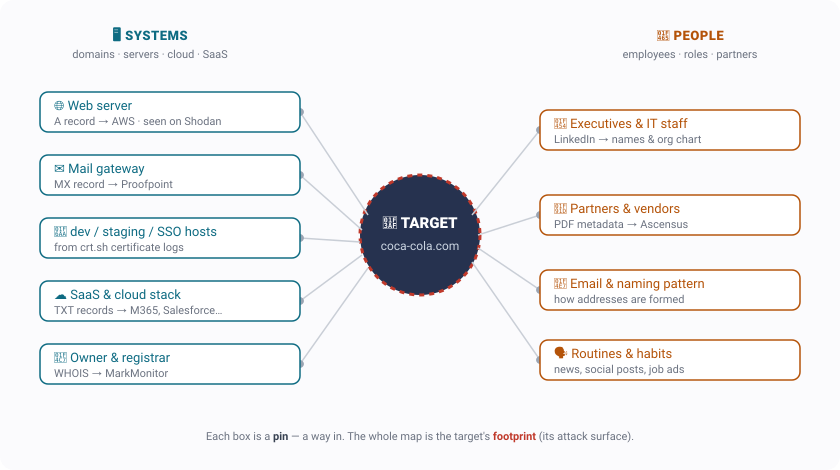
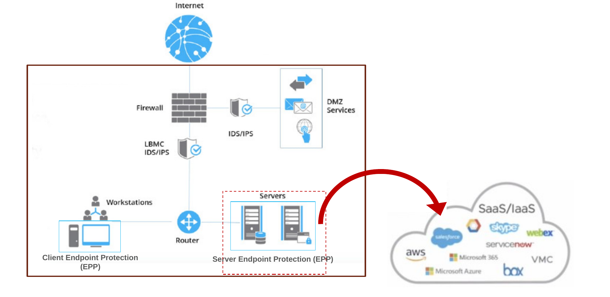
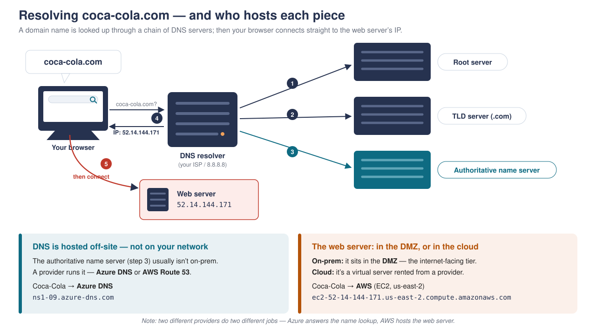

[← Course home](../index.html) · Ethical Hacking

# Week 2 · Reconnaissance & Footprinting

🧭 Kill chain · Phase 1 — Reconnaissance

The red line down the left marks the **attacker's** view (most of this page). The blue line near the end marks the **defender's** view.

🔴 RED TEAM · attacker's view

What you'll learn

- **Reconnaissance (recon)** = quietly building a *map* of a target before touching it
- The two things you put on the map: **systems** and **people**
- The six moves: **WHOIS → DNS → crt.sh → zone transfer → Shodan → OSINT**
- **Passive vs. active** recon — and why you always start passive
- How the map (the **footprint**) feeds every later phase — and how defenders shrink it

🥤 Running example — coca-cola.com

Every move below is shown on **one real target, `coca-cola.com`**, using public sources only. Follow the flow and watch a global company's footprint come together from its name alone.

------------------------------------------------------------------------

## 1. Recon is building a map

Like the crew in *Ocean's Eleven* studying the casino before the heist, an attacker studies a target **before touching it**. The goal is to build a **map** of everything that could be a way in. Every item you find is a **pin** on that map. There are two kinds of pins — **systems** (servers, websites, cloud services) and **people** (employees, partners) — and the finished map is called the **footprint**: the target's whole *attack surface*.

<figure>
 

<figcaption>Recon fills in this map. Left = systems, right = people. Each box is a pin (a possible way in); together they are the target's footprint. The rest of this page is how you find each one.</figcaption>
</figure>

------------------------------------------------------------------------

## 2. The goal: find a way in

A company keeps its internal network hidden — from the outside it's a **black box**. But a few systems *face the world* on purpose: the public **web server** and **mail server**. These live in the **DMZ** (*demilitarized zone* — the small, exposed slice of a network that's meant to be reachable from the internet). Those are the front doors. Recon is casing the building: *which doors face the street, which are guarded, and who comes and goes* — almost entirely from public information.

<figure>
 

<figcaption>The DMZ (web + mail) faces the world; the internal network stays hidden. Recon maps that outside edge — plus the partners and people around it.</figcaption>
</figure>

------------------------------------------------------------------------

## 3. The recon flow — click through it

Six moves take you from a bare domain name to a full footprint. **Click each step** to see the tool, the command, and what it reveals about Coca-Cola. They escalate: the first steps are *passive* (the target never knows), and step 4 is the one that crosses into *active* (the target could notice).

STEP 1WHOISwho owns it

STEP 2DNSthe addresses

STEP 3crt.shside doors

STEP 4 · ACTIVEZone transferask for everything

STEP 5Shodanthe front door

STEP 6OSINT & Peoplethe wider net

↑ **Click a step** — each shows the tool, the command, and what it reveals about Coca-Cola

#### 🪪 WHOIS — the "deed"

**WHOIS** is a public registration record for a domain — like a property deed. You look it up; you never touch the target to read it.

**Coca-Cola:** the domain is owned by **The Coca-Cola Company** through the registrar **MarkMonitor** — a corporate registrar big brands use, with the personal contact details locked down. (A small cake shop's domain would often leak a real name and email right here.)

`whois coca-cola.com`

🚪 Doors so far: none — but you now know *who* you're up against.

#### 🧭 DNS — the address book

**DNS** (*Domain Name System* — the internet's address book) turns a name like `coca-cola.com` into the actual servers behind it. Reading its records maps the public-facing infrastructure. The record types:

- `A` record → the **web server's** IP address (the front door)
- `MX` record → the **mail** gateway — Coca-Cola's is **Proofpoint** (`…pphosted.com`)
- `NS` record → the **name servers** (the machines that answer DNS questions) — Coca-Cola's run on **Microsoft Azure**
- `TXT` record → text notes that quietly reveal the **SaaS stack**: Microsoft 365, Salesforce, Atlassian, DocuSign, KnowBe4

`nslookup -type=MX coca-cola.com`  ·  `dig +short TXT coca-cola.com`

🚪 Doors: the **web + mail servers** in the DMZ. *(See exactly how a name gets resolved, and who hosts each piece, in §4 below.)*

#### 🔎 crt.sh — the side doors

Every website with a padlock uses a **TLS certificate** (*Transport Layer Security* — the technology behind the 🔒 in your browser). You can't get one of these certificates without the hostname being written into a public log. So **certificate names *are* hostnames.**

The site **crt.sh** lists every certificate ever issued for a domain — which surfaces the forgotten `dev`, `staging`, and `sso` hosts that are often the softest way in. Each one is a new **pin**.

`crt.sh/?q=%.coca-cola.com`

⚠️ One net, not the only net: a wildcard certificate (`*.coca-cola.com`) hides the specific names behind it.

#### ⚠️ Zone transfer — asking for everything (the one ACTIVE step)

A **zone transfer** is a request that asks a name server to hand over its *entire* list of DNS records at once (the technical name is **AXFR**). Name servers are supposed to share that full list only with their own backup servers — so a properly configured one **refuses** a stranger. A **misconfigured** one dumps the whole zone, including internal hostnames it never meant to expose.

`dig AXFR coca-cola.com @ns1-09.azure-dns.com` → **Transfer failed** ✔ (correct, secure)  
`dig AXFR zonetransfer.me @nsztm1.digi.ninja` → **dumps the whole zone** (a safe practice domain built to allow this)

🚦 This is where recon crosses from **passive** to **active** — you asked *their* server to do something, and it can log your request. (It's still not *scanning* — that's probing the machines directly, which is next week.)

#### 📡 Shodan — the front door up close

**Shodan** is a search engine for internet-connected *devices* (instead of web pages). Look up the web server's IP address and you learn a lot about that front door.

**Coca-Cola:** ports **80** (nginx) and **443** (Apache) running on **Amazon Web Services (AWS)**, plus a list of **CVEs** for those software versions — including a critical one rated **9.8**. A **CVE** (*Common Vulnerabilities and Exposures*) is a public ID number for a known software flaw.

⚠️ Shodan only **guesses** at flaws from the version number in the server's banner — it hasn't actually tested anything, and the server may already be patched. These are *leads to confirm by scanning*, not proven holes. *(See the Equifax case below.)*

#### 👥 OSINT & people — the wider net

**OSINT** (*Open-Source Intelligence* — information gathered from publicly available sources) is how you map the *people*. **Google dorking** (using advanced search-engine operators to surface files a site never meant to expose) turns up leaked documents; the **metadata** hidden inside those documents names vendors and staff; **LinkedIn** maps the org chart.

**Coca-Cola:** `site:coca-cola.com filetype:pdf` → a PDF whose hidden metadata names **Ascensus** (their retirement-plan provider — a *partner* pin). LinkedIn → the CIO and the IT team.

🚪 People are pins too. *(See the Target and bank-job cases below.)*

------------------------------------------------------------------------

## 4. How DNS resolves — and who hosts each piece

When your browser needs `coca-cola.com`, a **resolver** walks a chain (root → `.com` → the target's **authoritative name server**) to get back the IP address; then your browser connects to the web server. The twist worth noticing: the **name lookup** and the **web hosting** are usually run by *different providers*.

<figure>
 

<figcaption>Microsoft Azure answers the name lookup; Amazon AWS hosts the web server. Two providers, two jobs — normal, not a contradiction.</figcaption>
</figure>

------------------------------------------------------------------------

## 5. Passive vs. active — the framework

Every pin you collect answers two questions — **how** you got it and **what** it's about. Almost everything above is *passive* (you read public sources and the target never knows). The single *active* move was the zone transfer, where you contacted their server directly.

|                                                                                |  <svg xmlns="http://www.w3.org/2000/svg" viewBox="0 0 24 24"><path d="M4 1h16a1 1 0 0 1 1 1v4a1 1 0 0 1-1 1H4a1 1 0 0 1-1-1V2a1 1 0 0 1 1-1m0 8h16a1 1 0 0 1 1 1v4a1 1 0 0 1-1 1H4a1 1 0 0 1-1-1v-4a1 1 0 0 1 1-1m0 8h16a1 1 0 0 1 1 1v4a1 1 0 0 1-1 1H4a1 1 0 0 1-1-1v-4a1 1 0 0 1 1-1M9 5h1V3H9zm0 8h1v-2H9zm0 8h1v-2H9zM5 3v2h2V3zm0 8v2h2v-2zm0 8v2h2v-2z"/></svg>  **Systems** |  <svg xmlns="http://www.w3.org/2000/svg" viewBox="0 0 24 24"><path d="M12 4a4 4 0 0 1 4 4 4 4 0 0 1-4 4 4 4 0 0 1-4-4 4 4 0 0 1 4-4m0 10c4.42 0 8 1.79 8 4v2H4v-2c0-2.21 3.58-4 8-4"/></svg>  **People** |
|--------------------------------------------------------------------------------|-------------------------------------------------------|------------------------------------------------------|
|  <svg xmlns="http://www.w3.org/2000/svg" viewBox="0 0 24 24"><path d="M11.83 9 15 12.16V12a3 3 0 0 0-3-3zm-4.3.8 1.55 1.55c-.05.21-.08.42-.08.65a3 3 0 0 0 3 3c.22 0 .44-.03.65-.08l1.55 1.55c-.67.33-1.41.53-2.2.53a5 5 0 0 1-5-5c0-.79.2-1.53.53-2.2M2 4.27l2.28 2.28.45.45C3.08 8.3 1.78 10 1 12c1.73 4.39 6 7.5 11 7.5 1.55 0 3.03-.3 4.38-.84l.43.42L19.73 22 21 20.73 3.27 3M12 7a5 5 0 0 1 5 5c0 .64-.13 1.26-.36 1.82l2.93 2.93c1.5-1.25 2.7-2.89 3.43-4.75-1.73-4.39-6-7.5-11-7.5-1.4 0-2.74.25-4 .7l2.17 2.15C10.74 7.13 11.35 7 12 7"/></svg>  **Passive** — never touch the target | WHOIS · DNS · crt.sh · Shodan · dorking               | LinkedIn · job posts · a leaked PDF                  |
|  <svg xmlns="http://www.w3.org/2000/svg" viewBox="0 0 24 24"><path d="m19.07 4.93-1.41 1.41A8.01 8.01 0 0 1 20 12a8 8 0 0 1-8 8 8 8 0 0 1-8-8c0-4.08 3.05-7.44 7-7.93v2.02C8.16 6.57 6 9.03 6 12a6 6 0 0 0 6 6 6 6 0 0 0 6-6c0-1.66-.67-3.16-1.76-4.24l-1.41 1.41C15.55 9.9 16 10.9 16 12a4 4 0 0 1-4 4 4 4 0 0 1-4-4c0-1.86 1.28-3.41 3-3.86v2.14c-.6.35-1 .98-1 1.72a2 2 0 0 0 2 2 2 2 0 0 0 2-2c0-.74-.4-1.38-1-1.72V2h-1A10 10 0 0 0 2 12a10 10 0 0 0 10 10 10 10 0 0 0 10-10c0-2.76-1.12-5.26-2.93-7.07"/></svg>  **Active** — the target can log you  | **zone transfer** · ping · banner grab                | eavesdropping · a pretext phone call                 |

**The rule:** start in the top-left, squeeze passive recon dry, and go active only when you have to — passive recon is essentially untraceable.

------------------------------------------------------------------------

## 6. It's real — three cases

🔓 Equifax (2017) — one unpatched version

Coca-Cola's server is probably patched — but *don't assume*, because one unpatched flaw is exactly how **Equifax** was breached. Equifax — a **credit bureau** (a credit-reporting agency like Experian and TransUnion) — failed to patch a known flaw in **Apache Struts**, a web-application *framework* (a different Apache project from the web server you saw on Shodan). The result: the personal data of about **147 million people** — names, Social Security numbers, dates of birth — was stolen. **Lesson: patch your internet-facing systems.**

🏭 Target (2013) — the weak partner

Coca-Cola may be locked down, but a **partner** may not be — exactly how **Target** was breached. Attackers phished **Fazio Mechanical**, an air-conditioning (HVAC) vendor with weak security, stole its login, and — because Target let the vendor in and hadn't **segmented** (walled off) its network — pivoted from Fazio into Target, planted malware on the **checkout terminals**, and scraped about **40 million payment-card numbers**. **Lesson: your weakest link can be a company you don't control.**

🥷 The bank job — people are the softest target

Red-teamer **Jayson Street** is hired by banks to break in. He pulls staff off **LinkedIn**, copies their **badges** from profile photos, and overhears a complaint at the staff pub about a VP furious over a botched update. The next morning he walks in with a **box of donuts** so someone holds the door, hands a teller a **fake memo** from that VP and a *"patch"* on a **USB stick** — and out of fear of the VP, they plug it in. Full remote access. Recon told him *who to be* and gave him a *believable story*. That's **social engineering** (Week 11). **Lesson: the map includes people, and people are the softest way in.**

------------------------------------------------------------------------

🔵 BLUE TEAM · defender's view

## Blue Team — how defenders counter recon

Everything above was the attacker mapping you. Here's the flip side — what a defender does about it. The defender sits in the **SOC** (*Security Operations Center* — the team that monitors for attacks).

The hard truth, and what to do about it

**Passive recon is essentially undetectable.** It happens on infrastructure you don't control — search engines, WHOIS records, certificate logs, LinkedIn — so you'll never get an alert that someone looked you up.

Since you can't *catch* passive recon, you **shrink the footprint** so there's less to find:

- **Disable zone transfers** to strangers (only your backup name servers should be allowed).
- **Strip metadata** from documents before publishing them.
- **Keep `dev` / `staging` / test systems off the public internet.**
- **Watch your own certificate-transparency logs** — know every hostname *before* an attacker does.
- **Run recon against yourself** regularly, and train staff so a "donuts and a USB stick" story doesn't work.

The less there is to find, the safer you are.

------------------------------------------------------------------------

## A note on MITRE ATT&CK

What is MITRE ATT&CK?

You'll see **MITRE ATT&CK** referenced across this course. It's a free, public catalog — maintained by the nonprofit **MITRE** — of the real techniques attackers use, each with an ID. The recon on this page maps to the *Reconnaissance* section of that catalog: for example **T1590** (gathering victim **network** info — the DNS and Shodan work) and **T1589** (gathering victim **identity** info — the LinkedIn and OSINT work). Think of it as a shared dictionary so defenders and attackers can name techniques precisely. Browse it at [attack.mitre.org](https://attack.mitre.org/tactics/TA0043/).

------------------------------------------------------------------------

## Try it yourself

Practice — only on a target you own or are authorized to test

Every tool on this page is free and public. On your own domain (or a practice target you're allowed to test), walk the same six moves: `whois yourdomain.com`, `crt.sh/?q=%.yourdomain.com`, `dig`/`nslookup` for the `A` / `MX` / `NS` / `TXT` records, and a Shodan lookup of the resulting IP. Keep asking one question: *how would I have made this harder to find?*

Remember

Reconnaissance = **build a map from public sources.** Add pins (systems **and** people), fill each one in, and start **passive**. The footprint you build here drives your scanning, your exploits, and your social engineering — everything later is built on it.

------------------------------------------------------------------------

## References

- **NIST SP 800-115** §4. [Free PDF](https://nvlpubs.nist.gov/nistpubs/legacy/sp/nistspecialpublication800-115.pdf)
- **OSINT Framework.** [osintframework.com](https://osintframework.com/)
- **MITRE ATT&CK — Reconnaissance (TA0043).** [attack.mitre.org](https://attack.mitre.org/tactics/TA0043/)
- **Target breach — Krebs on Security.** [Target Hackers Broke In Via HVAC Company](https://krebsonsecurity.com/2014/02/target-hackers-broke-in-via-hvac-company/)
- **Equifax breach — U.S. GAO.** [GAO-18-559](https://www.gao.gov/products/gao-18-559)
