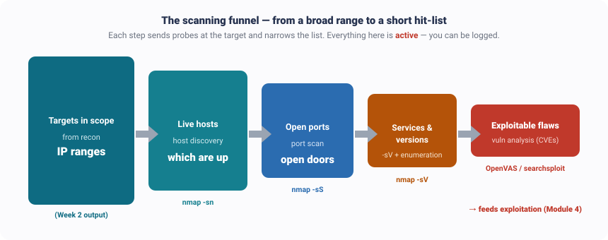
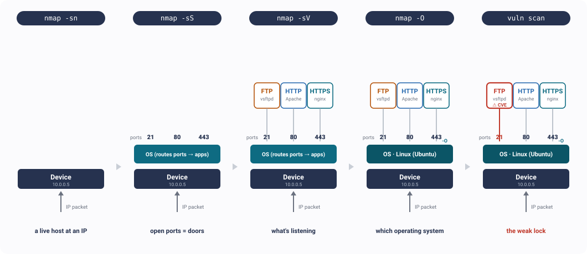

---
hide:
  - navigation
---

[← Course home](../index.html) · Ethical Hacking

# Week 3 · Scanning, Enumeration & Vulnerability Analysis

🧭 Kill chain · Phase 2 — Scanning

The red line down the left marks the **attacker's** view (most of this page). The blue line near the end marks the **defender's** view.

🔴 RED TEAM · attacker's view

What you'll learn

- Why scanning is the moment recon turns into **action** — and why that needs **authorization**
- The **scan flow**: live hosts → open ports → services → operating system → enumeration → vulnerabilities
- **Nmap**, the one tool that does most of this, and the commands that matter
- **Enumeration** — squeezing real detail (users, shares, versions) out of an open port
- **Vulnerability analysis** — turning "a service is running" into "here's an exploitable flaw"
- Why, unlike recon, scanning is **noisy and catchable** — and what defenders do about it

⚖️ The authorization line — read this first

Week 2 recon was **passive**: you read public records and never touched Coca-Cola, so it was legal to run against them. **Scanning is different.** From here on you send packets *straight at* the target's machines — and doing that to a system you don't own or aren't authorized to test can be a **crime**. So the commands below use an **authorized practice target**, `scanme.nmap.org` (a host Nmap runs specifically for people to practice on), or your lab network. We'll still *talk about* Coca-Cola to keep the story going — but we never point an active scanner at them.

## 1. From a map to open doors

In Week 2 you built a **map** of the target — a footprint of every system and person. But a map only tells you a door *exists*. **Scanning walks up and checks which doors are actually unlocked, and what's behind them.** Picture each machine as a **house**: the steps below find which houses are occupied, try every door, and look in the rooms behind the ones that open. It takes the broad list from recon and narrows it, step by step, to a short hit-list of things you could actually break into.

<figure>
 

<figcaption>Scanning is a funnel. Each step probes the target and narrows the list — from "all the IP addresses recon found" down to "the handful of services with a known, exploitable flaw." That short red list is what feeds the exploitation phase.</figcaption>
</figure>

## 2. The big shift: now you're *active*

A company's internal network is hidden, but recon found its **public-facing edge** — the web and mail servers. Scanning is walking up to that edge and **knocking on every door** to see which open. The catch: knocking is something the target can *hear*.

|                | Passive recon (Week 2)          | Active scanning (this week)             |
|----------------|---------------------------------|-----------------------------------------|
| 🕵️ **Contact** | Never touches the target        | Sends probes **straight at** the target |
| 📊 **Source**  | Public data — WHOIS, DNS, OSINT | Live host, port & service probing       |
| 🚨 **Risk**    | Stealthy, low legal risk        | **Noisy — authorization required**      |

**OSINT** = Open-Source Intelligence (the public-record gathering from Week 2). The one-line rule: *recon tells you what exists; scanning tells you what's reachable — and it can get you logged.*

## 3. The scan flow — click through it

Six steps take you from a bare IP range to a list of exploitable flaws. **Click each step** to see the tool, the command, and what it reveals. Unlike recon, **every step here is active** — you're touching the target the whole way.

STEP 1Host discovery<small>who's home</small>

STEP 2Port scan<small>which doors are open</small>

STEP 3Service & version<small>what's in the room</small>

STEP 4OS fingerprint<small>what it's built on</small>

STEP 5Enumeration<small>read the nameplate</small>

STEP 6Vuln analysis<small>which locks are weak</small>

↑ **Click a step** — each shows the tool, the command, and what it reveals

#### 📍 Host discovery — who's alive?

Before scanning ports, find out which addresses actually answer. No point port-scanning empty space.

`nmap -sn 192.168.1.0/24`  — a **ping sweep** across a whole range (`-sn` = "no port scan, just find live hosts").

🚪 Result: the list of machines that are actually up — your real targets.

#### 🚪 Port scan — which doors are open?

A **port** is a numbered door on a machine; each open one is a service you might reach. Ports come back in three states:

- **open** — a service is listening (a way in)
- **closed** — nothing listening, but the host replied
- **filtered** — a **firewall** silently dropped your probe (itself a clue about their defenses)

Two main styles (**TCP** = Transmission Control Protocol, **SYN** = the first packet of a TCP handshake):

- `nmap -sS scanme.nmap.org` — **SYN "half-open" scan**: starts the handshake, never finishes it. Fast and quieter — the default.
- `nmap -sT scanme.nmap.org` — **full connect scan**: completes every handshake. Reliable but **loud** (the target logs each one).
- `nmap -sU scanme.nmap.org` — **UDP scan** for connectionless services (DNS, SNMP). Slow, but many important services live here.

🚪 Result: the list of open doors on each live host.

#### 🔖 Service & version detection — what's running?

An open port isn't enough; you need the exact software and version behind it — that's what makes vulnerability-matching possible later.

`nmap -sV scanme.nmap.org`  — turns `port 22 open` into `OpenSSH 8.9p1`, the precise build.

🚪 Result: an inventory of services and their exact versions. *(This is the same idea as Shodan from Week 2 — but now you're reading it live, not from a public index.)*

#### 🖥️ OS fingerprint — which operating system?

Knowing it's Windows vs. Linux (and which version) narrows which attacks are even possible.

`nmap -O scanme.nmap.org` — guesses the **operating system** from subtle differences in how it replies.  
`nmap -sC scanme.nmap.org` — runs the safe default set of **NSE** scripts (Nmap Scripting Engine — hundreds of small add-on checks, from listing shares to testing for a specific flaw).

🚪 Result: the OS and a first pass of automated checks.

#### 🔍 Enumeration — read the nameplate

Scanning finds the door; **enumeration** reads the nameplate on it. Once a service is identified, you interrogate it for detail you can act on — usernames, shared folders, group memberships. Each protocol leaks different things:

- **SMB** (Server Message Block — Windows file sharing): shares, users, domain info — tools `enum4linux`, `smbclient`
- **SNMP** (Simple Network Management Protocol): device configs, routing tables — and watch for the default `public` password, a classic finding
- **LDAP** (directory service): the org's user and group tree
- **SMTP** (email): valid usernames, which feed password attacks later

🚪 Result: "port 445 is open" becomes "here are three usernames and an unprotected share." *(This is the heart of enumeration — turning a bare open port into specific, actionable detail.)*

#### 🎯 Vulnerability analysis — find the exploitable flaws

The payoff: turn your service inventory into a ranked list of **weaknesses**. A **vulnerability scanner** cross-references every detected version against a database of known flaws.

- **OpenVAS** / **Nessus** — scan every service and produce a report ranked by **CVSS** score (Common Vulnerability Scoring System, 0–10 severity)
- `searchsploit openssh 8.9` — check the local exploit database by hand; the **NVD** (National Vulnerability Database, <a href="https://nvd.nist.gov" target="_blank">nvd.nist.gov</a>) has full **CVE** detail (Common Vulnerabilities and Exposures — a public ID for each known flaw)

⚠️ The judgment call: a scanner's findings are **leads, not proven holes** — some are patched, some are false positives, some need a specific setup. Narrowing the list to what actually works is the real skill. *(Exactly the Shodan lesson from Week 2 — see the Equifax case below.)*

## 4. What you're actually mapping — the target fills in

The flow above narrows a *list*. Here's the flip side — what you learn about a **single machine**. Each step adds a layer to the picture, and the last one is the prize.

<figure>
 

<figcaption>A packet arrives at the device's IP address; the operating system hands it to whichever service is <strong>listening</strong> on that port. Scanning reveals this stack from the bottom up — host → open ports → services &amp; versions → OS — until one service (here, an old FTP server) turns out to have a known flaw: the weak lock.</figcaption>
</figure>

The one idea to hold on to

An **open port is a door**, the **service** behind it is what you actually attack, and its **version** is what tells you whether the lock is weak. That's why version detection (`nmap -sV`) matters so much — a port number on its own isn't enough.

------------------------------------------------------------------------

## 5. Vulnerability analysis is the bridge to breaking in

Steps 1–5 build a picture; step 6 turns it into a **target list**. That list is what the exploitation phase (Module 4) acts on. But the scanner is only a *first draft* — it flags everything that *might* be vulnerable from the version number, exactly like Shodan did in Week 2. The version banner says "OpenSSH 8.9"; whether *this* server is actually exploitable still has to be confirmed. Treating scanner output as a to-do list of leads — not a list of confirmed holes — is what separates a real assessment from a scan-and-paste report.

## 6. It's real — three cases

🔓 Equifax (2017) — the scan that would have caught it

The breach that stole ~**147 million people's** personal data began with a single **internet-facing** server running an unpatched version of **Apache Struts** (flaw **CVE-2017-5638**). That's precisely the kind of finding a routine **vulnerability scan** flags in its top-severity list. Scanning and vuln analysis aren't only an attacker's tool — run against *yourself*, they're the exact discipline that would have prevented one of the largest breaches in history. **Lesson: scan your own edge before someone else does.**

🐛 WannaCry (2017) — one open port, worldwide

WannaCry spread by scanning the internet for one thing: machines with **port 445** (SMB) open and an unpatched Windows flaw (**EternalBlue**). Any host that answered got infected and then scanned for *more* victims — over 200,000 machines in days. It's enumeration and scanning turned into an automatic weapon. **Lesson: an exposed service with a known flaw is not a small risk — it's a doorway that attackers actively hunt for.**

🐠 The casino fish tank (reported 2017) — the door nobody thinks of

A casino was breached through an internet-connected **thermometer in its lobby fish tank**. The security firm **Darktrace** reported that attackers used the smart aquarium sensor as a foothold, reached across the internal network to the casino's **high-roller database**, and pulled the data back out through that same device. When you scan a network, *everything that answers is a door* — including the forgotten internet-connected gadget nobody remembered was online. **Lesson: your attack surface is every device on the network, not just the servers — and (like Target in Week 2) segment the network so a fish-tank sensor can never reach your crown jewels.**

------------------------------------------------------------------------

🔵 BLUE TEAM · defender's view

## Blue Team — how defenders counter scanning

Here's the big difference from Week 2: **passive recon was invisible, but scanning is loud.** Because the attacker now sends packets at your systems, you can actually *see* it. The defender sits in the **SOC** (Security Operations Center — the team that watches for attacks).

You can detect it — and you can shrink what it finds

A ping sweep plus a full port scan makes **hundreds of connection attempts in seconds**. That's a detectable pattern: **one source touching many ports or many hosts in a short window**. Vulnerability scanners are louder still, and often leave a scanner name in the web logs:

    index=web_logs status=404 (useragent="*nmap*" OR useragent="*nessus*" OR useragent="*gobuster*")
    | stats count by clientip | where count > 50

But you can't *stop* someone from scanning your public edge — so the real defense is to **shrink the attack surface** so scans come back nearly empty:

- **Close unused ports** and turn off services you don't need.
- **Put management services** (SSH, RDP, admin panels) **behind a VPN** (Virtual Private Network), not the open internet.
- **Rate-limit** probes at the firewall so mass scans are slowed and flagged.
- **Scan yourself first** and **patch what you find** — so the attacker's scan turns up nothing you haven't already fixed.

The less that answers when someone knocks, the safer you are.

------------------------------------------------------------------------

## A note on MITRE ATT&CK

What is MITRE ATT&CK?

**MITRE ATT&CK** is a free, public catalog — maintained by the nonprofit **MITRE** — of the real techniques attackers use, each with an ID. This week's work maps to its *Discovery* and *Reconnaissance* sections: for example **T1046** (Network **Service** Discovery — the port and service scanning) and **T1018** (Remote **System** Discovery — host discovery). It's a shared dictionary so defenders and attackers can name techniques precisely. Browse it at [attack.mitre.org](https://attack.mitre.org/tactics/TA0007/).

------------------------------------------------------------------------

## Try it yourself

Practice — only on a target you own or are authorized to test

Every tool here is free. Against Nmap's authorized practice host `scanme.nmap.org` (or your own lab network), walk the whole flow: `nmap -sn` a range to find live hosts, `nmap -sS` and `nmap -sV` for open ports and versions, `nmap -O` for the operating system, then look up a version with `searchsploit` or the NVD. Keep asking one question: *how would I have made this harder to find?*

**Next week →** we stop *finding* weaknesses and start *using* the network against itself — **Network Hacking & Sniffing.**

Remember

Scanning = **turn recon's map into a hit-list.** Find live hosts, open ports, services, and versions; enumerate the detail; then narrow it to the flaws that actually work. It's **active** — authorized targets only — and unlike recon, defenders can see you coming.

------------------------------------------------------------------------

## References

- **Nmap Network Scanning** (official book) — Host Discovery & Port Scanning. [nmap.org/book](https://nmap.org/book/toc.html)
- **NIST SP 800-115** §4.2 (network scanning), §4.3 (vulnerability scanning). [Free PDF](https://nvlpubs.nist.gov/nistpubs/legacy/sp/nistspecialpublication800-115.pdf)
- **MITRE ATT&CK — Discovery (TA0007).** [attack.mitre.org](https://attack.mitre.org/tactics/TA0007/)
- **Equifax breach — U.S. GAO.** [GAO-18-559](https://www.gao.gov/products/gao-18-559)
- **Scan legally:** [scanme.nmap.org](http://scanme.nmap.org) — Nmap's authorized practice host.
